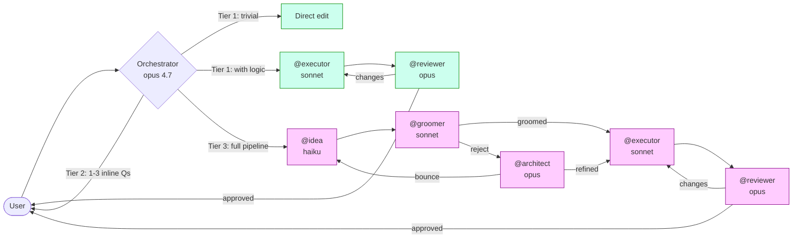
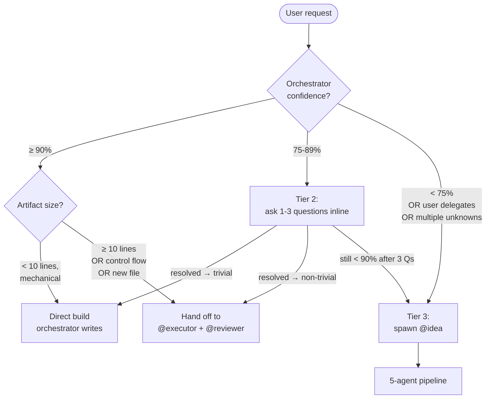
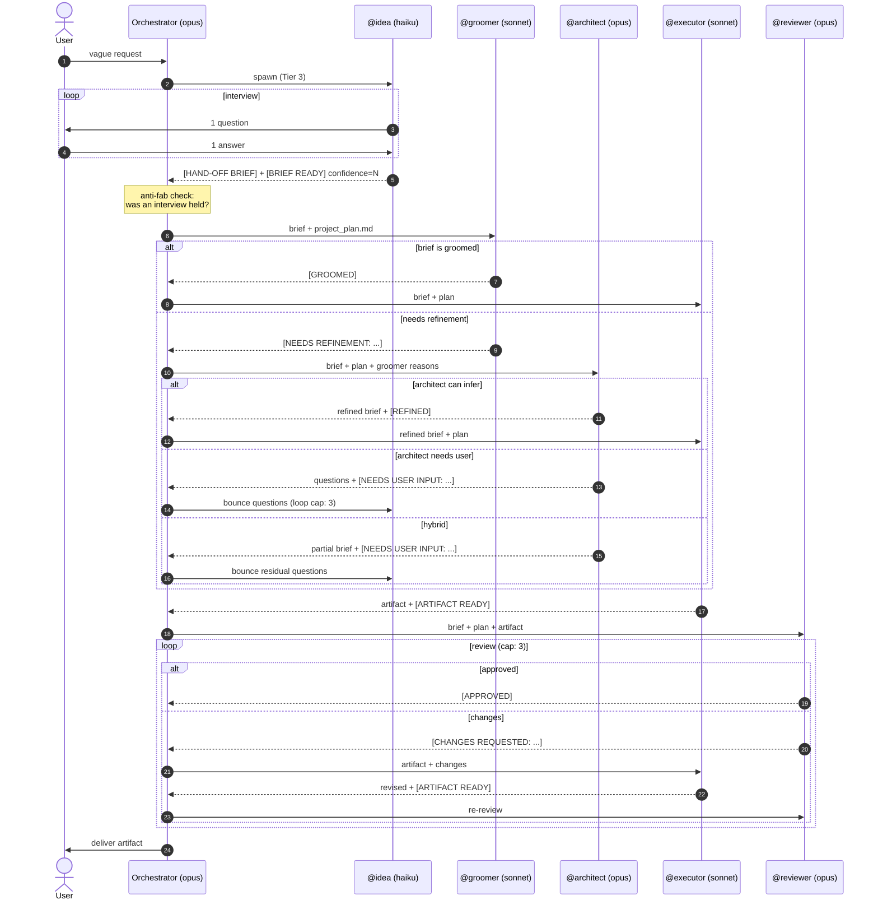
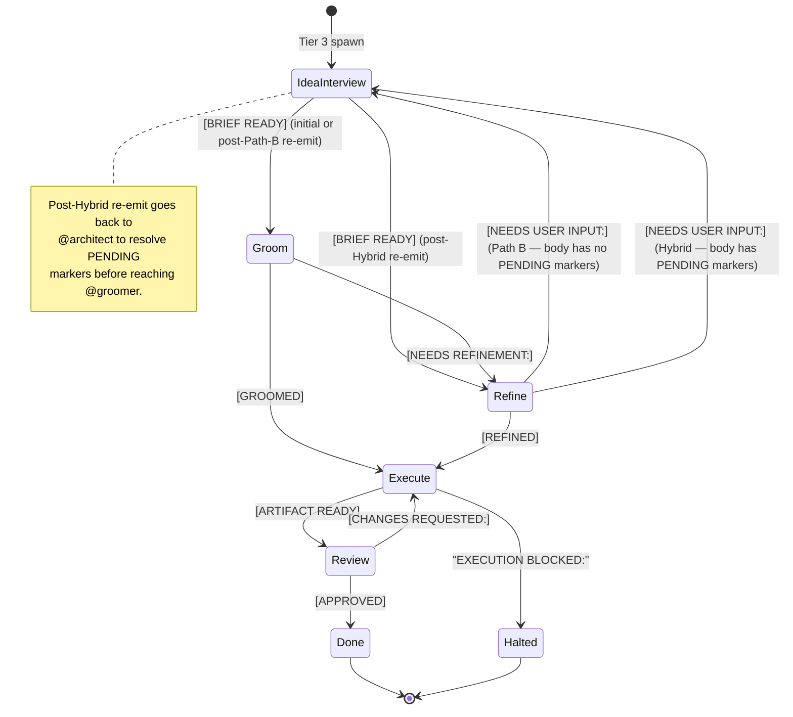
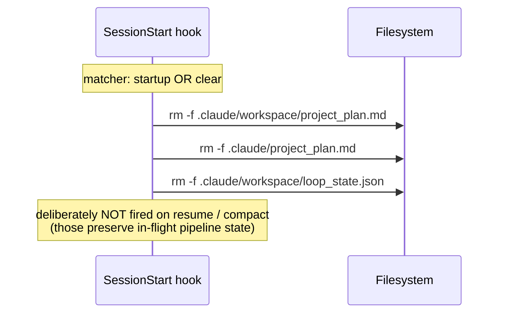

# claude-workflow.md — Architecture

This document explains how the orchestrator and the 5-agent pipeline cooperate. For the operational rules, see `CLAUDE.md`. For the rationale-and-critique knowledgebase, see `.claude/knowledgebase/agent_critique.md`.

**Last-reviewed:** 2026-05-28 against `claude-opus-4-7`.

---

## 1. System at a glance



ASCII fallback:

```
                    ┌───────────────┐
                    │     User      │
                    └───────┬───────┘
                            │
                    ┌───────▼────────┐
                    │  Orchestrator  │  (opus 4.7, the main session)
                    │  3-tier router │
                    └───┬────┬────┬──┘
                Tier 1  │    │    │  Tier 3
                        │    │ Tier 2: orchestrator
                        │    │ asks user 1-3 Qs
                        │    │ then routes Tier 1 or Tier 3
                        ▼    ▼    ▼
            ┌───────────────────┐  ┌──────────┐
            │ direct edit       │  │ @idea    │ haiku
            │   OR              │  │ interview│
            │ @executor sonnet  │  └────┬─────┘
            │  + @reviewer opus │       │ [BRIEF READY]
            └───────────────────┘       ▼
                                   ┌──────────┐
                                   │ @groomer │ sonnet
                                   │ audit    │
                                   └────┬─────┘
                            [GROOMED]   │   [NEEDS REFINEMENT]
                              ┌─────────┴─────────┐
                              │                   ▼
                              │             ┌──────────┐
                              │             │@architect│ opus
                              │             │ refine   │
                              │             └────┬─────┘
                              │       [REFINED]  │  [NEEDS USER INPUT]
                              │           ┌──────┘
                              ▼           ▼              └──→ back to @idea
                          ┌──────────┐
                          │ @executor│ sonnet
                          │ build    │
                          └────┬─────┘
                               │ [ARTIFACT READY]
                               ▼
                          ┌──────────┐
                          │ @reviewer│ opus
                          │ audit    │
                          └────┬─────┘
                  [APPROVED]   │   [CHANGES REQUESTED]
                       │       └─→ back to @executor
                       ▼
                    user gets the artifact
```

---

## 2. The 3-tier routing decision

Every user request enters this decision tree BEFORE any tool use.



**Why three tiers?** Cost asymmetry. Opus is expensive, sonnet is mid, haiku is cheap. A request the orchestrator (opus) can answer alone shouldn't spawn anyone. A trivial edit doesn't need a sonnet review. A genuinely ambiguous request needs a structured interview, which haiku is competent for and cheap at. The tiers route work to the cheapest competent tier.

| Tier | Confidence | Cost profile | What runs |
|---|---|---|---|
| 1 (direct) | ≥ 90% | One opus turn (if mechanical) or 1 opus + 1 sonnet handoff + 1 opus review (if ≥ 10 lines) | orchestrator alone, OR orchestrator + @executor + @reviewer |
| 2 (inline triage) | 75-89% | Same as Tier 1 plus 1-3 conversational turns | orchestrator + user dialogue, then Tier 1's two paths |
| 3 (full pipeline) | < 75% | ≥ 5 agent spawns (haiku + sonnet + opus + sonnet + opus) | the full pipeline below |

**Tier 1's "Tiny vs Larger" split** is itself a sub-router: tiny work stays on opus (faster end-to-end); larger work hands off to sonnet for the build and opus for the review (cheaper per token + catches bugs).

---

## 3. Full pipeline sequence (Tier 3)



**Loop caps** (3 cycles each) are enforced by the orchestrator using `.claude/workspace/loop_state.json`. Working memory is unreliable across context compaction; the file is authoritative.

---

## 4. Cue state machine

The agents communicate exclusively via bracketed cues parsed by the orchestrator. Last-occurrence wins.



| Cue | Emitter | Routes to |
|---|---|---|
| `[BRIEF READY] confidence=N` | @idea | @groomer |
| `[GROOMED]` | @groomer | @executor |
| `[NEEDS REFINEMENT: reasons]` | @groomer | @architect |
| `[REFINED]` | @architect | @executor |
| `[NEEDS USER INPUT: questions]` | @architect | @idea |
| `[ARTIFACT READY]` | @executor | @reviewer |
| `EXECUTION BLOCKED: reason` | @executor | user (halt) |
| `[APPROVED]` | @reviewer | user (done) |
| `[CHANGES REQUESTED: list]` | @reviewer | @executor |

**Parser rules:**
- Last occurrence in the response wins (lets the model think then commit).
- Distinct cue prefixes required. `[NEEDS REFINEMENT:` vs `[NEEDS USER INPUT:` diverge at the second word — match the full cue name, not the `[NEEDS ` prefix.
- Mutually exclusive cues within an agent's turn.

---

## 5. Cross-agent learning channel

The pipeline is forward-only, but `@reviewer` and the orchestrator can leave breadcrumbs that `@groomer`, `@idea`, and `@architect` read on entry.

```
                 ┌─────────────┐
                 │  @reviewer  │ writes failure class
                 └──────┬──────┘
                        │ Edit (append)
                        ▼
   ┌────────────────────────────────────────┐
   │ .claude/agent-memory/_shared/          │
   │   cross_agent_findings.md              │
   │                                        │
   │   ## 2026-05-28T... | @reviewer → @groomer │
   │   **Failure class:** DoD-missing-tests │
   │   **Evidence:** ...                    │
   │   **Recommendation:** ...              │
   └────────────────────────────────────────┘
                        │ Read (last ~20)
              ┌─────────┼─────────┐
              ▼         ▼         ▼
        ┌─────────┐ ┌──────┐ ┌──────────┐
        │@groomer │ │@idea │ │@architect│
        └─────────┘ └──────┘ └──────────┘
```

This is the only path by which one agent's discovery influences another's behavior across invocations.

---

## 6. File and directory layout

```
claude-workflow.md/
├── ARCHITECTURE.md                ← this file
├── CLAUDE.md                       ← operational rules (routing, cues, loops, hooks)
└── .claude/
    ├── agents/                     ← agent prompt files
    │   ├── idea.md      (haiku)
    │   ├── groomer.md   (sonnet)
    │   ├── architect.md (opus)
    │   ├── executor.md  (sonnet)
    │   └── reviewer.md  (opus)
    ├── agent-memory/               ← per-agent persistent memory
    │   ├── _shared/
    │   │   └── cross_agent_findings.md
    │   ├── idea/
    │   ├── groomer/         (created on first write)
    │   ├── architect/
    │   ├── executor/        (created on first write)
    │   └── orchestrator/
    │       └── routing_observations.md
    ├── knowledgebase/
    │   └── agent_critique.md       ← deep-critique knowledgebase
    ├── workspace/                  ← per-session runtime state
    │   ├── project_plan.md         (created by @idea/@architect)
    │   └── loop_state.json         (created by orchestrator)
    ├── settings.json               ← hooks
    └── settings.local.json         ← user-scoped settings
```

**State purity:** `.claude/workspace/` is treated as scratch — the `SessionStart` hook wipes `project_plan.md`, the fallback `.claude/project_plan.md`, and `loop_state.json` on `startup` and `clear` events. Persistence lives in `agent-memory/`.

---

## 7. Hooks

`.claude/settings.json` installs one `SessionStart` hook with two matchers (`startup`, `clear`). Each clears stale per-session state:



Why two matchers but identical commands: `startup` fires on fresh `claude` invocation, `clear` fires on `/clear`. Both are "fresh context" boundaries where keeping yesterday's plan is harmful. `resume` and `compact` deliberately don't fire because an in-flight plan IS still relevant context.

---

## 8. Model-tier rationale

| Agent | Model | Why this tier |
|---|---|---|
| @idea | haiku | Interviews are social/structural, not analytical. Haiku is competent and 5-10× cheaper than opus. |
| @groomer | sonnet | The right test of "can this be built?" is run by the SAME model that will build it. Maps 1:1 to @executor's actual capability. |
| @architect | opus | Catching design-phase bugs is much cheaper than fixing them after the build. One opus pass < several executor re-runs. |
| @executor | sonnet | Build cost. Sonnet output is ~5× cheaper than opus per token, and the brief constrains scope tightly enough that opus reasoning depth is overkill. |
| @reviewer | opus | Review quality depends on (a) catching subtle bugs and (b) communicating them precisely. Opus depth + writing clarity are both load-bearing. |
| orchestrator | opus 4.7 | Routes everything; needs strong judgment on tier classification and cue parsing. |

---

## 9. Known issues, workarounds, and deferred items

See `CLAUDE.md` sections **Known issues & workarounds** and **Deferred items** for the live list. Highlights:

- **Agent-prompt cache:** edits to `.claude/agents/*.md` do not take effect until session restart. Version stamps at the bottom of each agent file mark the last review date.
- **Stale plan defense:** the `SessionStart` hook now wipes both candidate plan paths plus `loop_state.json`. The orchestrator additionally does a positive-confirmation Read after `@idea` returns.
- **Deferred (intentionally not built yet):** pipeline test harness, `/calibrate` skill, `@editor` agent for prose, description-splitting investigation, pre-spawn agent-hash check.

---

## 10. Reading order for newcomers

1. **`ARCHITECTURE.md`** (this file) — what the system IS.
2. **`CLAUDE.md`** — operational rules the orchestrator follows.
3. **`.claude/knowledgebase/agent_critique.md`** — what's wrong with it and what would make it better.
4. **`.claude/agents/*.md`** — the actual prompts, in order of pipeline appearance.

<!-- last-reviewed: 2026-05-28 against claude-opus-4-7 -->
