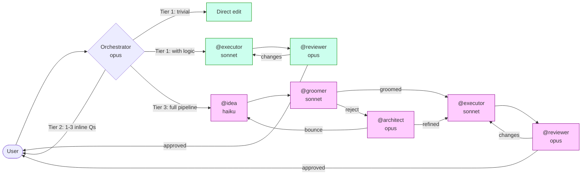

# claude-workflow.md

A workflow engine for Claude Code — defined entirely in natural language.

No Python. No YAML. No framework. The orchestration logic lives in a single markdown file (`CLAUDE.md`) that the Claude Code orchestrator reads and follows at runtime.

---

## What it is

A 5-agent pipeline wired into your Claude Code session via a git submodule. You describe a task; the orchestrator decides how much structure it needs and routes accordingly.



**Three tiers, five agents, one markdown file.**

| Tier | When | What happens |
|------|------|--------------|
| 1 | Orchestrator is ≥90% confident | Builds directly or hands off to `@executor` — no questions asked |
| 2 | 75–89% confident, 1–2 unknowns | Orchestrator asks up to 3 inline questions, then builds |
| 3 | <75% confident or complex scope | Full pipeline: `@idea` interviews → `@groomer` audits → `@architect` refines → `@executor` builds → `@reviewer` approves |

| Agent | Model | Role |
|-------|-------|------|
| `@idea` | haiku | Requirements interview — one question at a time |
| `@groomer` | sonnet | Gate: is the brief executor-ready? |
| `@architect` | opus | Refines ambiguous briefs or sends targeted questions back |
| `@executor` | sonnet | Builds the artifact |
| `@reviewer` | opus | Code-reviews against the brief; approves or requests changes |

For the full design — cue-parsing rules, loop caps, anti-fabrication enforcement, cross-agent memory — see [`ARCHITECTURE.md`](ARCHITECTURE.md).

---

## Try it

```bash
# 1. Add the submodule
git submodule add https://github.com/suchakra/claude-workflow.md.git .claude/workflow
git submodule update --init

# 2. Wire it into your project (one-time)
bash .claude/workflow/init.sh

# 3. Restart Claude Code — agents load on session start
```

`init.sh` does three things: symlinks the five agents into `.claude/agents/`, prepends `@.claude/workflow/CLAUDE.md` to your `CLAUDE.md`, and installs the `SessionStart` hooks in `.claude/settings.json`.

### Staying current

```bash
git submodule update --remote .claude/workflow
```

---

## Design notes

- **No code** — the routing logic, cue-parsing rules, loop caps, and agent protocols are all in `CLAUDE.md`. If you can read it, you can modify it.
- **Tiered cost** — haiku for interviews, sonnet for building/auditing, opus only where reasoning depth matters (architecture, review). Tier 1 skips the pipeline entirely.
- **Accumulating memory** — each agent has its own memory directory under `.claude/agent-memory/`. Findings from `@reviewer` feed back to `@groomer` via a shared file, so the pipeline improves across sessions.
- **Hard limits** — refinement loop capped at 3 bounces, review loop at 3 cycles. State persisted to disk so limits survive context compaction.

---

## What it is not

- A general-purpose agent framework. This is Claude Code-specific: it uses `CLAUDE.md` loading, `.claude/agents/` discovery, and `settings.json` hooks. It does not port to other providers.
- A product. It is a workflow you can adopt, fork, and fix. Bugs go back upstream via the submodule.

---

## Questions and ideas welcome

Open an issue or start a discussion on [GitHub](https://github.com/suchakra/claude-workflow.md). Particularly interested in: how the tier thresholds hold up across different project types, and whether the cue-driven pipeline survives model upgrades.
